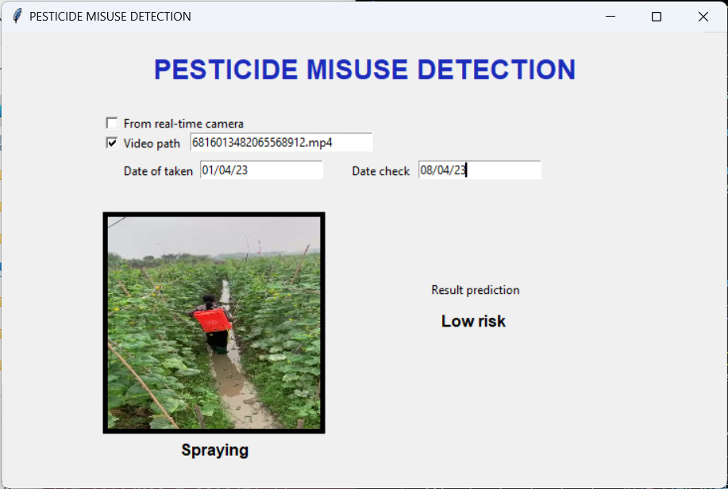

# PesVit App
Welcome to PesVit App! This README file will provide instructions on how to use the app.

## Installation
To install the app, first make sure you have Python 3 installed on your machine. Then, clone the repository from GitHub:
```
git clone https://github.com/cuong3004/PesVit
```

Once you have cloned the repository, navigate to the project directory and install the required dependencies:

```
cd PesVit/application
pip install -r requirements.txt
```

## Usage

To use the app, simply run the app.py file:
```
python app.py
```

### use video
To use for video. You need Enter the start date, end date, and video name in the corresponding fields.

Note: Make sure that you have entered the correct format for the start and end dates in the "dd/mm/yy" format.


